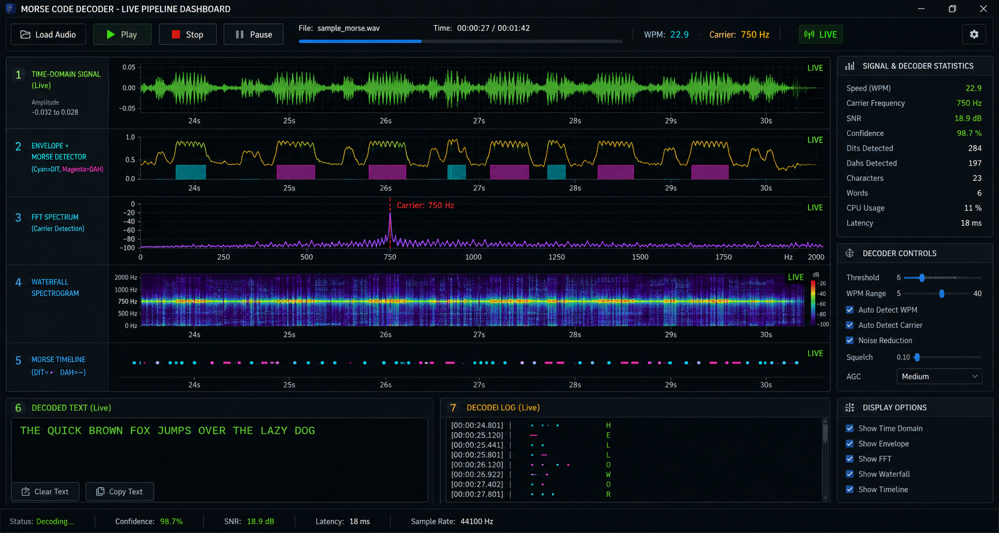

# Morse-Code-Decoder

A modular **Morse code audio decoder in Python** built as a team project for Object-Oriented Programming at TH Köln.

The system supports recorded audio and live audio input, detects the Morse carrier, extracts the signal envelope, estimates transmission speed, converts dits/dahs to text, and applies a lightweight character-level language model to correct ambiguous decoder output.



## Highlights

- **Object-oriented audio architecture** with an abstract `AudioSource` interface
- File, in-memory, paced-file and microphone audio sources
- Automatic carrier-frequency detection using FFT
- Butterworth bandpass filtering and Hilbert-envelope extraction
- Adaptive Morse timing / WPM estimation
- End-to-end Morse-to-text decoding
- Live streaming decoder and dashboard
- Character-level N-gram language-model correction
- Reusable timing and decoding pipeline
- Verification scripts covering multiple WPM ranges and language-model cases

## Processing pipeline

```text
Audio Source
    │
    ├── File / Microphone / Array / Paced File
    │
    ▼
Carrier Frequency Detection (FFT)
    │
    ▼
Bandpass Filtering
    │
    ▼
Hilbert Envelope + Adaptive Smoothing
    │
    ▼
Morse Detection
    │
    ├── Dit / Dah detection
    ├── Gap classification
    └── Adaptive WPM estimation
    │
    ▼
Morse → Text
    │
    ▼
Language-Model Correction
    │
    ▼
Decoded Text + Timing / Visualization
```

## Architecture

The project separates responsibilities into reusable modules:

```text
morse-code-decoder/
│
├── docs/
│   ├── architecture.md
│   └── assets/
│       └── live-dashboard.png
│
├── notebooks/
│   └── Morse_Decoder_AllInOne.ipynb
│
├── scripts/
│   ├── generate_morse_audio.py
│   ├── generate_test_tone.py
│   └── build_notebook.py
│
├── src/
│   ├── audio/
│   │   ├── audio_source.py
│   │   ├── array_source.py
│   │   ├── file_source.py
│   │   ├── microphone_source.py
│   │   └── paced_file_source.py
│   │
│   └── processing/
│       ├── adaptive_decoder.py
│       ├── decode_pipeline.py
│       ├── frequency_detector.py
│       ├── language_model.py
│       ├── morse_decoder.py
│       ├── morse_detector.py
│       ├── morse_table.py
│       ├── signal_processor.py
│       ├── stream_decoder.py
│       ├── timing.py
│       └── visualizer.py
│
├── tests/
│   ├── test_array_source.py
│   ├── test_end_to_end.py
│   ├── test_file_source.py
│   ├── test_language_model.py
│   ├── test_microphone_source.py
│   ├── test_morse_detector.py
│   ├── test_paced_file_source.py
│   ├── test_signal_processor.py
│   ├── test_stream_decoder.py
│   ├── test_visualizer.py
│   └── test_wpm_range.py
│
├── main.py
├── run_decoder.py
├── requirements.txt
└── README.md
```

## Key implementation ideas

### 1. `AudioSource` abstraction

The decoder does not depend on one specific input device. `AudioSource` defines the common interface:

- `start()`
- `stop()`
- `read_chunk()`

Concrete implementations provide file, microphone, in-memory and paced-file sources. This lets the same downstream processing pipeline work with different input modes.

### 2. Carrier-frequency detection

The frequency detector uses a real-valued FFT to identify the strongest Morse carrier within the configured search range. A frequency mask rejects unrelated low-frequency hum and out-of-band components.

### 3. Signal processing

The processing chain is:

```text
Audio
  → Butterworth bandpass
  → Hilbert envelope
  → adaptive / moving-average smoothing
```

The bandpass isolates the CW carrier. The Hilbert transform extracts the amplitude envelope, making the Morse keying pattern easier to detect.

### 4. Adaptive WPM detection

The decoder does not require the sender's WPM to be known in advance.

It analyses detected tone durations and estimates the characteristic dit length, then uses that timing to classify:

- dits
- dahs
- intra-character gaps
- character gaps
- word gaps

The verified test range covers **10–40 WPM**.

### 5. Language-model correction

The language-model layer operates after Morse decoding. It corrects ambiguous characters while preserving already-valid words.

The current verification set contains:

- **11/11 correction cases passed**
- **26/26 preservation cases passed**
- **37/37 total passed**

The model uses a character-level N-gram approach with a vocabulary built from the project's language data.

## Verification results

### End-to-end decoding

The clean-signal end-to-end suite currently verifies four representative messages:

| Test | WPM | Result |
|---|---:|---|
| `HELLO WORLD` | 20 | PASS |
| `CQ DE TEST` | 20 | PASS |
| `THE QUICK BROWN FOX` | 15 | PASS |
| `ABC 123` | 25 | PASS |

**Result: 4/4 test cases passed.**

### Adaptive WPM range

A dedicated verification covers **13 transmission speeds from 10 to 40 WPM**.

- **13/13 speeds decoded exactly**
- Mean WPM estimation error: **3.4%**
- Maximum estimation error: **6.4%**

### Language model

- **11/11** corrupted-text corrections passed
- **26/26** valid-text preservation cases passed
- **37/37** total verification cases passed

These are verification results on the project's controlled test cases; they are not a claim of universal real-world decoding accuracy.

## Running the project

### 1. Create an environment

Python 3.11 is the recommended version for the project.

```bash
python -m venv .venv
```

Windows PowerShell:

```powershell
.\.venv\Scripts\Activate.ps1
```

Linux / macOS:

```bash
source .venv/bin/activate
```

### 2. Install dependencies

```bash
pip install -r requirements.txt
```

### 3. Run the end-to-end verification

From the project root:

```bash
python -m tests.test_end_to_end
```

Expected result:

```text
Summary: 4/4 test cases passed
End-to-end pipeline: PASS
```

### 4. Test adaptive WPM

```bash
python -m tests.test_wpm_range
```

Expected result:

```text
13/13 speeds decoded exactly
WPM estimate error: mean 3.4%, max 6.4%
RESULT: full 10-40 WPM range works.
```

### 5. Test the language model

```bash
python -m tests.test_language_model
```

Expected result:

```text
Correction: 11/11
Preservation: 26/26
Total: 37/37
LanguageModel verification: PASS
```

### 6. Decode an audio file

```bash
python -m run_decoder path/to/audio.wav
```

Or run the built-in generated demonstration:

```bash
python -m run_decoder --demo
```

You can also specify custom text and WPM:

```bash
python -m run_decoder --text "HELLO WORLD" --wpm 20
```

Generated audio is intentionally excluded from Git. The repository contains scripts that recreate deterministic test signals locally.

## Notebook

`notebooks/Morse_Decoder_AllInOne.ipynb` provides an interactive walkthrough of the decoder components, including:

- Morse table
- audio sources
- signal generation
- carrier-frequency detection
- filtering and envelope extraction
- Morse detection
- decoding
- timing
- language-model correction
- visualization / dashboard components

The notebook is kept as a reproducible demonstration; generated audio files are not committed.

## Design principles

### Separation of concerns

Audio acquisition, signal processing, timing, decoding, language correction and visualization are implemented as separate modules.

### Single source of truth

The Morse table and the shared decoding pipeline are reused across applications and tests instead of maintaining separate implementations.

### Reusable pipeline

The central decoding pipeline returns structured results so file-mode, live-mode, notebook and test code can use the same processing logic.

### Testable components

The project includes dedicated verification scripts for audio sources, signal processing, Morse detection, streaming, timing, visualization and language-model behavior.

## Limitations

- Controlled test signals are cleaner than typical real-world radio recordings.
- Microphone performance depends on the available audio device and acoustic environment.
- Noise, interference, fading and severe timing drift can reduce decoding quality.
- The language model is designed as a correction layer, not as a general-purpose English spell checker.
- The current implementation focuses on English-oriented Morse decoding.

## Academic context

**Course:** Object-Oriented Programming — TH Köln, Summer Semester 2026

This was developed as a collaborative academic project. The repository is published as a technical portfolio example; generated local environments, recordings and machine-specific files are intentionally excluded.

## Technologies

**Python · NumPy · SciPy · SoundDevice · SoundFile · Matplotlib · Jupyter · Digital Signal Processing · OOP · Audio Processing · Morse Code · N-gram Language Modeling**
