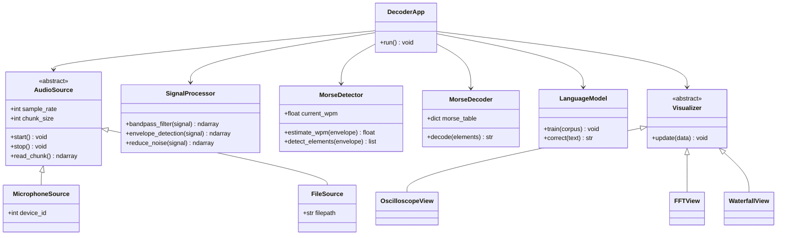

# Architecture

## Overview
The Morse Code Decoder follows a modular object-oriented design. Each module has a single responsibility: audio input, signal processing, Morse detection, decoding, language correction, visualization, and orchestration.

## Class Diagram



## Module Responsibilities

### AudioSource (abstract)
- Defines the interface for any audio input.
- Subclasses: `MicrophoneSource` (live mic via sounddevice), `FileSource` (mp3/wav playback).
- Outputs raw audio chunks as numpy arrays.

### SignalProcessor
- Applies bandpass filter centered on the CW tone frequency (typically 600–800 Hz).
- Extracts the envelope (amplitude over time) via rectification + low-pass, or Hilbert transform.
- Optional adaptive noise reduction.

### MorseDetector
- Thresholds the envelope to identify on/off periods.
- Estimates words-per-minute (WPM) adaptively.
- Classifies each pulse as dit, dah, element-gap, letter-gap, or word-gap.

### MorseDecoder
- Maps dit/dah patterns to characters using the standard Morse table.
- Handles prosigns (CQ, K, AR, SK).

### LanguageModel
- Character-level N-gram model trained on amateur radio conversations and English text.
- Scores ambiguous decoder outputs and applies probabilistic corrections.

### Visualizer (abstract)
- Common interface for live signal displays.
- Subclasses: `OscilloscopeView` (time domain), `FFTView` (frequency domain), `WaterfallView` (spectrogram).

### DecoderApp
- Top-level orchestrator. Wires audio source, processor, detector, decoder, language model, and visualizer.
- Owns the GUI window that displays decoded text in real-time.

## Data Flow

```
AudioSource --> SignalProcessor --> MorseDetector --> MorseDecoder --> LanguageModel --> UI
                       |
                       +------> Visualizer
```

## Out of Scope
- Multi-language support (English only).
- Direct WebSDR integration (use virtual audio cable workaround).
- Mobile UI.